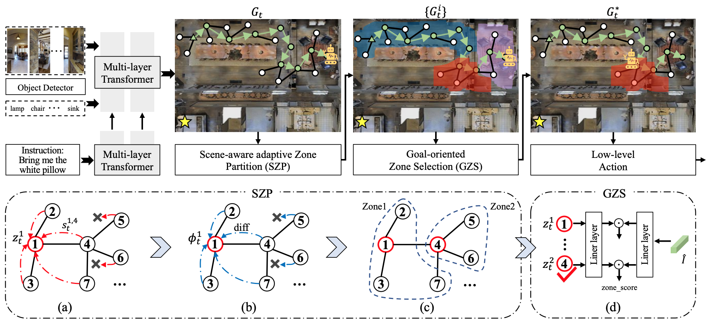

# Adaptive Zone-aware Hierarchical Planner

Code for our CVPR 2023 paper "[Adaptive Zone-aware Hierarchical Planner for Vision-Language Navigation](https://openaccess.thecvf.com/content/CVPR2023/papers/Gao_Adaptive_Zone-Aware_Hierarchical_Planner_for_Vision-Language_Navigation_CVPR_2023_paper.pdf)"

## Introduction
In this paper, we propose an Adaptive Zone-aware Hierarchical Planner (AZHP) to explicitly divides the navigation process into two heterogeneous phases, i.e., sub-goal setting via zone partition/selection (high-level action) and subgoal executing (low-level action), for hierarchical planning. Specifically, AZHP asynchronously performs two levels of action via the designed State-Switcher Module (SSM). For high-level action, we devise a Scene-aware adaptive Zone Partition (SZP) method to adaptively divide the whole navigation area into different zones on-the-fly. Then the Goaloriented Zone Selection (GZS) method is proposed to select a proper zone for the current sub-goal. For low-level action, the agent conducts navigation-decision multi-steps in the selected zone.



## Get Started
1. Install Matterport3D simulators: follow instructions [here](https://github.com/peteanderson80/Matterport3DSimulator). We use the latest version instead of v0.1.
```
export PYTHONPATH=Matterport3DSimulator/build:$PYTHONPATH
```

2. Install requirements:
```setup
conda create --name AZHP python=3.8.5
conda activate AZHP
pip install -r requirements.txt
```

3. Download data from [Baidu Drive](https://pan.baidu.com/s/1dfbYjoSkKrRmU_7rgoCY2Q?pwd=e1qm), including pretrained lxmert, processed annotations, features and pretrained models of REVERIE, SOON, and R2R datasets. Put the data in `datasets' directory.


## Pretrain

```pretrain
cd pretrain_src
bash run_reverie.sh
bash run_r2r.sh
bash run_soon.sh
```

## Finetune

```finetune
cd map_nav_src
bash scripts/run_reverie.sh
bash scripts/run_r2r.sh
bash scripts/run_soon.sh
```
## Test
Directly download the well-trained model or submitted result files from [Baidu Drive (passcode:98q3)](https://pan.baidu.com/s/1cw_GjDHGnHv-jb8GRYsfWw) or use your own trained models.
```test
cd map_nav_src
bash scripts/run_reverie_test.sh
bash scripts/run_r2r_test.sh
bash scripts/run_soon_test.sh
```
  
## Acknowledge
Some of the codes are built upon [DUET](https://github.com/cshizhe/VLN-DUET), [NvEM](https://github.com/MarSaKi/NvEM) and [EnvDrop](https://github.com/airsplay/R2R-EnvDrop). Thanks them for their great works!

